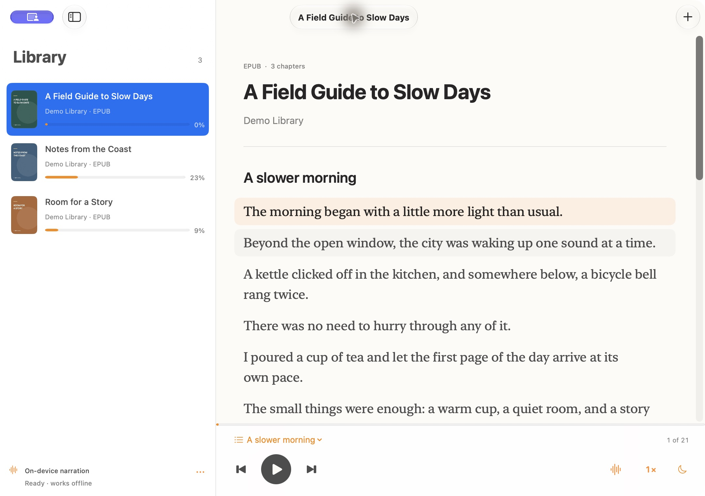
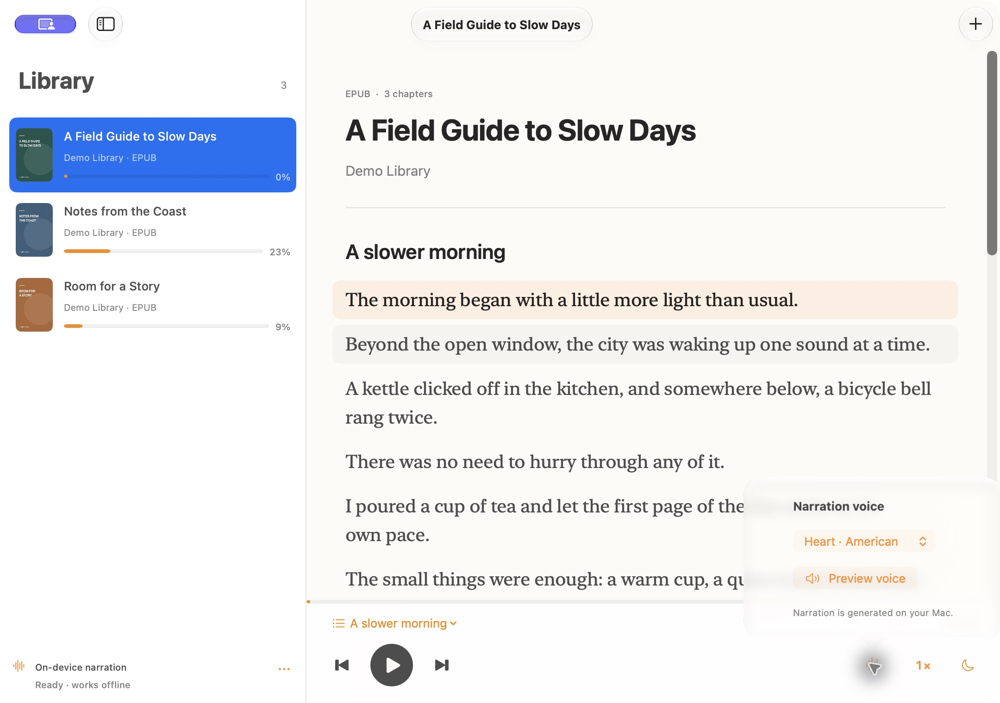
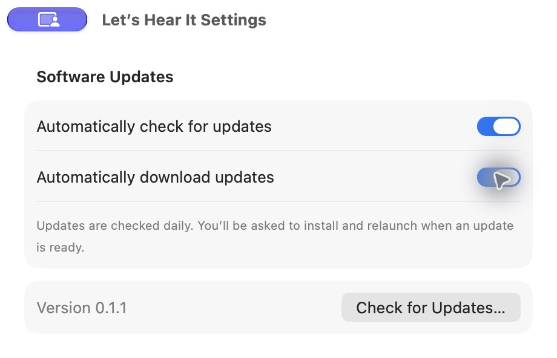

# Let’s Hear It

A native macOS app for reading and listening to English EPUBs and text-based PDFs. Narration runs locally on your Mac.

This repository hosts downloadable releases and the signed update feed. The application’s source repository is private.

## Download

[Download the latest release](https://github.com/khantseithu/letshearit-updates/releases/latest).

Requires an Apple Silicon Mac (M1 or later) running macOS 15 or later.

1. Download and open the DMG.
2. Drag **Let’s Hear It.app** into **Applications**.
3. Open the app from Applications.
4. Choose **Set up speech**, then **Download voice**. Initial setup requires an internet connection; listening runs locally afterward.

The app is ad-hoc signed and not notarized by Apple. If macOS blocks the first launch and you trust this release, follow [Apple’s instructions](https://support.apple.com/en-ie/102445): try opening the app, then go to **System Settings → Privacy & Security → Open Anyway** and confirm **Open**.

## Updates

Version 0.1.1 and later check for updates daily, verify signed downloads, and offer to install and relaunch. Use **Let’s Hear It → Check for Updates…** for a manual check, or **Settings → Software Updates** to change automatic checks and downloads.

Version 0.1.0 needs one manual upgrade to 0.1.1 to get the updater. Your books, progress, speech runtime, and downloaded voices are kept when updating the app.

Each release includes the DMG, `SHA256SUMS.txt`, and the signed `appcast.xml` read by the updater.

## Screenshots

Captured from version 0.1.1 with sample books, covers, and original demo text.

### Library and reader

Book covers, sentence highlighting, saved progress, and playback controls in one window.

### Local narration

Choose a narration voice and preview it before listening. Speech is generated on your Mac.

### Software updates

Control automatic update checks and downloads, or check for a new release immediately.

